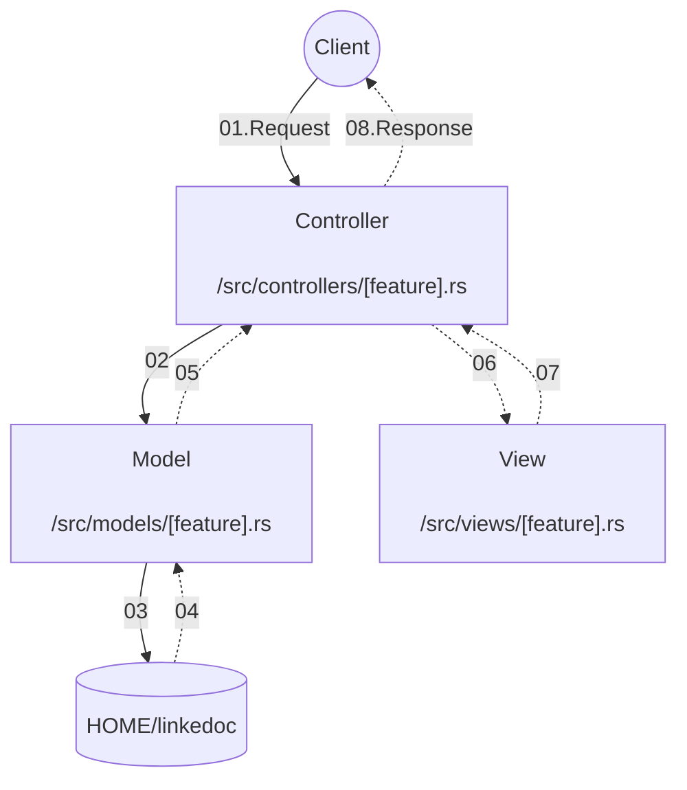

# linkedoc

## Architecture

```mermaid
flowchart TD
    Client(("Client"))
    Controller["Controller<br><br>/src/controllers/[feature].rs"]
    Model["Model<br><br>/src/models/[feature].rs"]
    View["View<br><br>/src/views/[feature].rs"]
    DB[(HOME/linkedoc)]

    %% Top to Bottom
    Client --01.Request--> Controller
    Controller --02--> Model
    Model --03--> DB

    %% Bottom to Top
    DB -.04.-> Model
    Model -.05.-> Controller
    Controller -.06.-> View
    View -.07.-> Controller
    Controller -."08.Response".-> Client
```
